# Grokker

<div align="left">
  <p style="color: #666666;">
    By A𝚕𝚎𝚓𝚊𝚗𝚍𝚛𝚘 A𝚌𝚎𝚟𝚎𝚍𝚘 A., <i>P𝚑.D.</i>
  </p>
</div>


```mermaid
%%{
    init: {
        'theme': 'dark',
        'flowchart': {
            'curve': 'basis',
            'defaultLinkColor': '#4B6B8C',
            'nodeSpacing': 100,
            'rankSpacing': 50
        }
    }
}%%
graph TD;
    START([🚀 Start]):::first --> clean_messages
    clean_messages --> validate_context
    
    validate_context --> guidance_agent{{Guidance Agent}}
    validate_context --> process_context
    validate_context --> context_request_agent{{Context Request Agent}}
    
    guidance_agent{{Guidance Agent}} --> guidance_agent_ask_human
    guidance_agent{{Guidance Agent}} --> tool_node_prompt
    guidance_agent{{Guidance Agent}} --> END([🏁 End]):::last
    
    guidance_agent_ask_human --> guidance_agent{{Guidance Agent}}
    
    process_context --> validate_state
    tool_node_prompt --> validate_state
    
    context_request_agent{{Context Request Agent}} --> END
    
    validate_state --> analyst_agent{{Analyst Agent}}
    
    analyst_agent{{Analyst Agent}} --> tools_node_analyst
    analyst_agent{{Analyst Agent}} --> END
    
    tools_node_analyst --> analyst_agent{{Analyst Agent}}

    classDef default fill:#2E3D54,stroke:none,rx:10,ry:10;
    classDef first fill:#1B5E20,stroke:none,rx:15,ry:15;
    classDef last fill:#0066CC,stroke:none,rx:15,ry:15;
    classDef agent fill:#614C66,stroke:none;
    
    %% Styling for agents
    style guidance_agent fill:#614C66,stroke:none
    style analyst_agent fill:#614C66,stroke:none
    style context_request_agent fill:#614C66,stroke:none
```

### App

### Chat


# Levantar Aplicación

Pasos para poner en marcha tanto el servicio de backend como el de frontend.

---

## Levantar el Servicio de Backend

### 1. Restaurar el Ambiente Virtual


instalar uv

```bash
curl -LsSf https://astral.sh/uv/install.sh | sh
```

Ejecute el siguiente comando para restaurar el entorno virtual (.venv):

```bash
uv sync
```

En backend/src lanzar el backend

```bash
uv run run_service.py 
```

### Levantar servicio de frontend

en el directorio frontend

Instalar bun en caso de que no esté

```bash
curl -fsSL https://bun.sh/install | bash
bun --version
```
Instalar las librerias

```bash
bun install
```
Lanzar el front
```bash
bun run dev
```

# Uso

Para garantizar la operatividad completa de la aplicación, es imperativo mantener ambos servicios ejecutándose simultáneamente. El backend proporciona una API REST que expone los endpoints necesarios para la comunicación con el modelo de lenguaje y el procesamiento de datos, mientras que el frontend sirve la interfaz de usuario a través de un servidor de desarrollo. La comunicación entre ambas capas se realiza mediante peticiones HTTP/HTTPS, por lo que la inactividad de cualquiera de los servicios resultará en una degradación funcional del sistema.