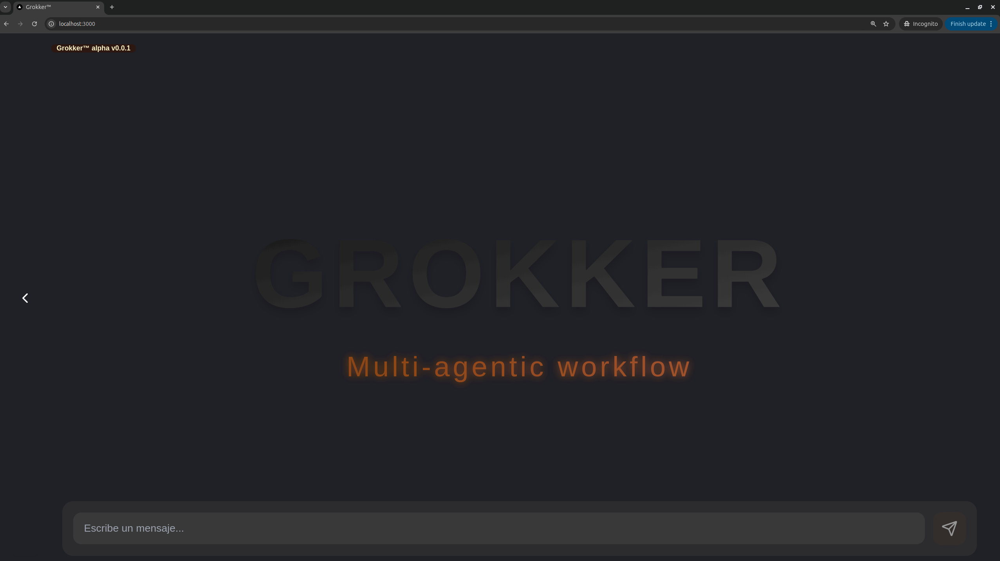
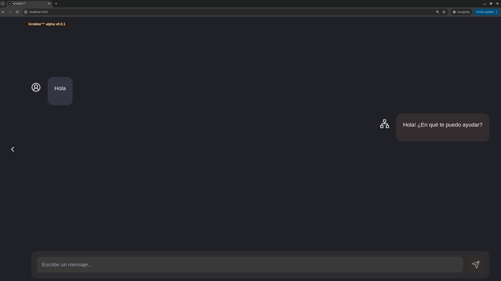

# Grokker

  

    By A𝚕𝚎𝚓𝚊𝚗𝚍𝚛𝚘 A𝚌𝚎𝚟𝚎𝚍𝚘 A., <i>P𝚑.D.</i>
  

```mermaid
%%{
    init: {
        'theme': 'dark',
        'flowchart': {
            'curve': 'basis',
            'defaultLinkColor': '#4B6B8C',
            'nodeSpacing': 100,
            'rankSpacing': 50
        }
    }
}%%
graph TD;
    START([🚀 Start]):::first --> clean_messages
    clean_messages --> validate_context
    
    validate_context --> guidance_agent{{Guidance Agent}}
    validate_context --> process_context
    validate_context --> context_request_agent{{Context Request Agent}}
    
    guidance_agent{{Guidance Agent}} --> guidance_agent_ask_human
    guidance_agent{{Guidance Agent}} --> tool_node_prompt
    guidance_agent{{Guidance Agent}} --> END([🏁 End]):::last
    
    guidance_agent_ask_human --> guidance_agent{{Guidance Agent}}
    
    process_context --> validate_state
    tool_node_prompt --> validate_state
    
    context_request_agent{{Context Request Agent}} --> END
    
    validate_state --> analyst_agent{{Analyst Agent}}
    
    analyst_agent{{Analyst Agent}} --> tools_node_analyst
    analyst_agent{{Analyst Agent}} --> END
    
    tools_node_analyst --> analyst_agent{{Analyst Agent}}

    classDef default fill:#2E3D54,stroke:none,rx:10,ry:10;
    classDef first fill:#1B5E20,stroke:none,rx:15,ry:15;
    classDef last fill:#0066CC,stroke:none,rx:15,ry:15;
    classDef agent fill:#614C66,stroke:none;
    
    %% Styling for agents
    style guidance_agent fill:#614C66,stroke:none
    style analyst_agent fill:#614C66,stroke:none
    style context_request_agent fill:#614C66,stroke:none
```
### App

### Chat
